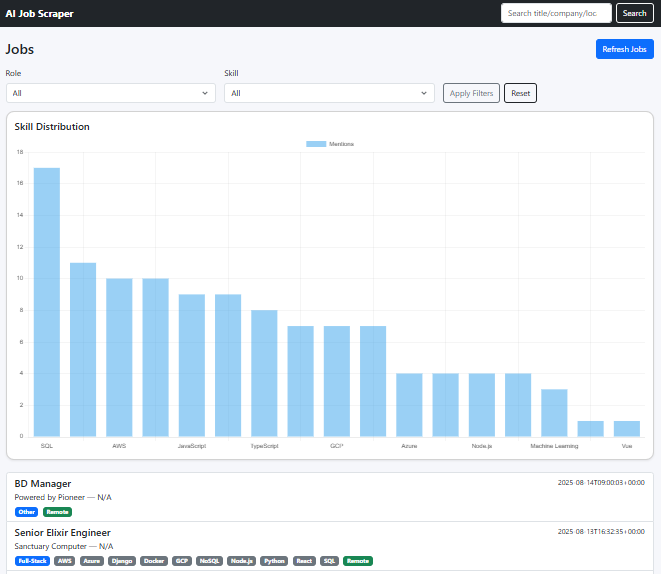

# 🛠️ AI Job Scraper — Intelligent Job Aggregator & Classifier


> **An intelligent job scraping and classification tool** that aggregates postings from multiple APIs, stores them in MongoDB, and classifies roles using both **rule-based logic** and **AI (OpenAI GPT)** — perfect for quickly identifying relevant opportunities.

---

## 🚀 Features

- **Multi-Source Scraping** — Fetches jobs from:
  - [Arbeitnow](https://arbeitnow.com/api/job-board-api)
  - [RemoteOK](https://remoteok.com/api)
- **Dual Classification**:
  - **Rule-based** (fast, offline, no cost)
  - **OpenAI GPT-powered** (accurate, nuanced)
- **MongoDB Storage** — Persistent job storage with indexed queries
- **/refresh Endpoint** — Instantly update and classify job listings
- **Dashboard Ready** — Optional UI for real-time visualization

---

## 🧩 Tech Stack

| Layer            | Technology                 |
|------------------|---------------------------|
| Backend API      | Flask (Python)            |
| Database         | MongoDB                   |
| AI Classifier    | OpenAI GPT-4 (optional)   |
| Scraping Sources | Arbeitnow, RemoteOK       |
| Deployment       | Render / Railway / Heroku |

---

## 📦 Installation

```bash
git clone https://github.com/saud06/ai-job-scraper.git
cd ai-job-scraper
python -m venv .venv
source .venv/bin/activate   # Windows: .venv\Scripts\activate
pip install -r requirements.txt
```

---

## 🖥️ Usage

### Refresh Jobs

```bash
curl -X GET http://localhost:5000/refresh
```

### Example Response

```json
{
  "arbeitnow_jobs": 50,
  "remoteok_jobs": 50,
  "classified_jobs": 100
}
```

---

## 📊 Example Dashboard

If UI is enabled:


---

## 🧠 How Classification Works

1. **Rule-Based** — Checks keywords in title & description
2. **AI-Based** — Sends job details to OpenAI GPT for nuanced role detection
3. Stores the predicted `role` & `key_skills` in MongoDB

---

## 🌍 Live Demo

🔗 [Live Deployment](https://ai-job-scraper-0not.onrender.com)
*(Deployed on Render — cold starts may take a few seconds)*

---

## 💡 Why I Built This

> As a Master's student in Web & Data Science with 2.5+ years in software development, I wanted to create a project that blends **data engineering, AI, and web development** into something directly useful — like finding relevant jobs fast.

---

## 📬 Contact

* **GitHub**: [saud06](https://github.com/saud06)
* **LinkedIn**: [Saud M.](https://linkedin.com/in/saud06)
* **Email**: [saud.mn6@gmail.com](mailto:saud.mn6@gmail.com)